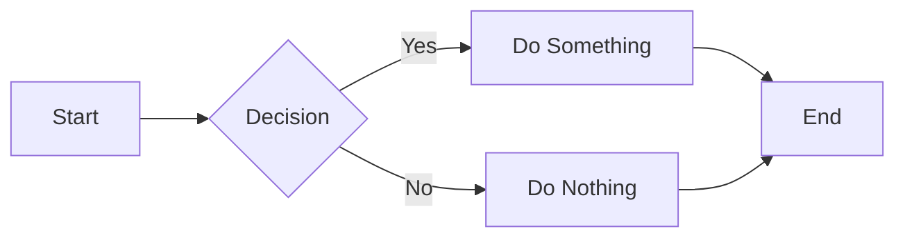

## Mermaid Diagram (unsupported)

```mermaid
graph LR
    A[Start] --> B{Decision}
    B -->|Yes| C[Do Something]
    B -->|No| D[Do Nothing]
    C --> E[End]
    D --> E
```

The above should render as a plain code block, not crash.
